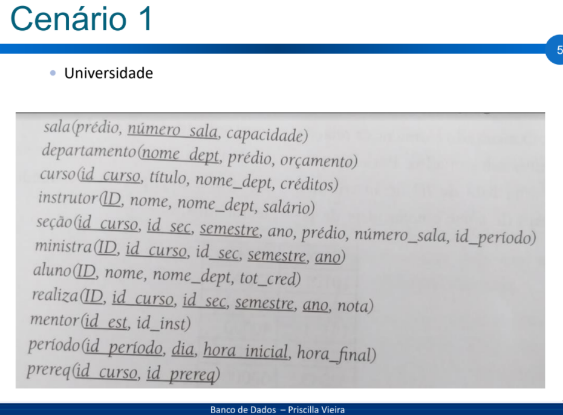

  <h1>Projeto de Banco de Dados</h1>

Esse projeto foi desenvolvido durante o curso de Banco de Dados 2020.3 - UFAPE

 

  

## 📜 Sobre
Dupla: Gustavo Sales, Abrahão Leandro 
 
O projeto era para criar um banco de dados como na imagem acima, popular ele com dados falsos e resolver as seguintes queries: 
1. Achar os Ids de todos os alunos que foram lecionados por um instrutor
chamado Einstein; cuide para que não haja duplicatas no resultado.
2. Gere a lista de todos os departamentos, com o número total de instrutores em
cada departamento.
3. Achar todos os instrutores que ganham o salário mais alto (pode haver mais de
um com o mesmo salário).
4. Achar o número máximo de matriculados, por todas as seções, no outono de
2019.
5. Ache o ID e a média de pontos de cada aluno.

## 🛠 Instruções de Execução
1. Rode o arquivo de DDL para criação do banco e as tabelas
2. Rode o arquivo de SEED para popular o banco de dados
3. Rode o arquivo de DML para executar as queries
